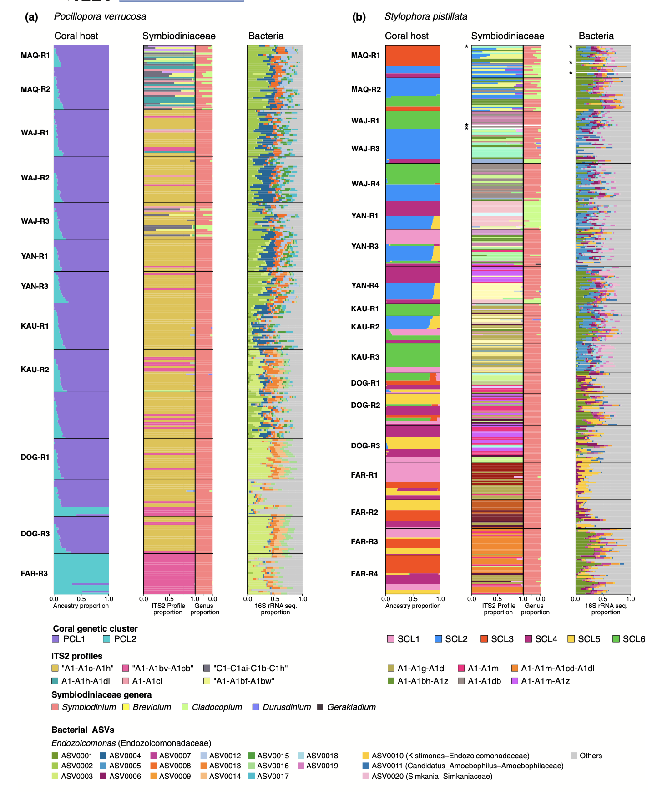

```{r setup, include=FALSE}
knitr::opts_chunk$set(echo = TRUE)
suppressMessages(library(tidyverse))
```


# Bacteria (ASV Table)

```{r}
read_delim("../data/Files/ASV_table") -> bacteria

dim(bacteria) #  659 by 33173

head(bacteria)
```

```{r}
tail(bacteria)
```

# Bacteria Taxonomy Table
```{r}
read_delim("../data/Files/16S_tax.txt") -> bacteria_tax

dim(bacteria_tax)
```


```{r}
names(bacteria_tax)
```

### How many bacterial species? 

- 226 but most ASVs have NA as species. For this analysis, the focus is on the ASV as the bacteria strain, but it's good to see how many are not ID'd to a specific species
```{r}
bacteria_tax %>% 
  group_by(Species) %>% 
  summarise(n = n()) %>% 
  arrange(-n)
```

- NA for species is 32904:
```{r}
33173 - 32904
```
- Only 269 of the 33,173 ASVs have been ID'd with a species, otherwise the genera is the next step up in taxonomy. 

### How many different genera? 1,390 with 16,482 having NA as Genus

```{r}  
bacteria_tax %>% 
  group_by(Genus) %>%
  summarise(n = n()) %>%
  arrange(-n) 
```

- Since there are still NAs for Genus, are there NAs for Family? Yes, there are 5115 NAs for Family
- Other than the NAs, there are 482 bacteria Family names

```{r}
bacteria_tax %>% 
  group_by(Family) %>%
  summarise(n = n()) %>%
  arrange(-n) 
```

## What about Order? Are there any NAs?
- There are 308 Orders without any NA values
```{r}
bacteria_tax %>% 
  group_by(Order) %>% 
  summarise(n = n())
```


```{r}
bacteria %>% 
  rename(sample_id = `...1`) -> bacteria
```

## ASV0001 EDA
```{r}
# column to be explored
bacteria$ASV0001

# overview stats of ASV0001 counts (abundance)
summary(bacteria$ASV0001)

# how many rows are 0?
sum(bacteria$ASV0001==0) /nrow(bacteria) # 199 out of 659 samples = 30.2 % are 0 values

plot(bacteria$ASV0001)
```

- The published work from March 2023 (insert link) has the below vizualization with a focus on the top 20 bacterial strains in order of abundance. The ASV numbers indicate the top 20 such that ASV001 - ASC0020 are the ones pictured in the Admixture analysis. 

```{r}
names(bacteria[1:21])
```

### Admixture Analysis from Buitrago-López and Cárdenas, et al

Citation: 

DOI: 10.1111/mec.16871 




```{r}
```


```{r}
```


```{r}
```


```{r}
```


```{r}
```


```{r}
```


```{r}
```


```{r}
```


```{r}
```


```{r}
```


```{r}
```


```{r}
```

