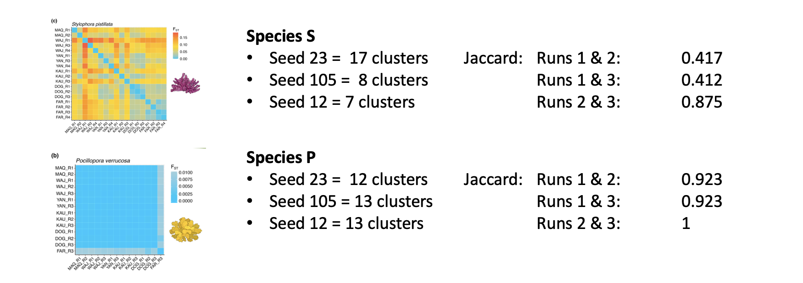
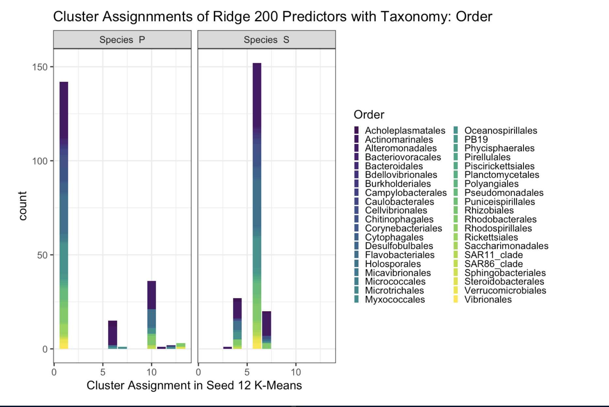

```{r setup, include=FALSE}
knitr::opts_chunk$set(echo = TRUE)

```

\begin{center}
Client: Dr. Anny Cardenas, American University
\end{center}

\begin{center}
ABSTRACT
\end{center}

Relationships between coral algae and bacteria provide insight into the algal symbiont, i.e., the wholistic interaction of algae and bacteria within coral tissues that work to regulate nutrient cycling and resilience to thermal or environmental changes. (Morris 2019). In this project report, unsupervised and supervised machine learning (ML) methods are applied to coral microbiome data in an attempt to 1) find clusters of bacteria that tend to be found together per species, and 2) determine the most associated bacteria strains of clade C algae from these data. Part I utilizes the unsupervised ML method of K-means clustering; and Part II utilizes the supervised ML methods of Ridge, Lasso, Random Forest and Boosted Trees to find the lowest error rates associated with a binary classification of clade C or non-clade C. Key findings include the possible role of genetic profile in the performance of K-means as well as how the Ridge method of logistic classification performed overall better than other methods with predictor variables showing cluster assignments that are predominantly in one group. 

\begin{center}
INTRODUCTION
\end{center}

Coral reefs are documented as supporting an abundance of marine life and contribute to the livelihood of humans. Algae and bacteria in coral tissues work to regulate the coral's overall health and are documented as able to adapt to their environment; however, corals remain sensitive to anthropogenic impact around the world. Conservation efforts to mitigate and reverse the tide of coral reef stress, particularly in terms of bleaching, necessitate the study of how coral survive and the role of varying types of algae and bacteria. (Buitrago-Lopez et al 2023) The research questions addressed in this paper attempt to contribute to this effort by examining the performance of machine learning algorithms on coral microbiome data. 


\begin{center}
RESEARCH QUESTIONS
\end{center}

How can machine learning (ML) methods be applied to coral microbiome data?

1. Part I: Unsupervised ML
    + Which bacteria amplicon sequence variants (ASVs) tend to be clustered together?
    
2. Part II: Supervised ML
    + Which ASVs are associated the most with algae of clade C, with a preference towards ML methods with higher interpretability and the inclusion of as many ASV predictors as possible? 

\newpage

\begin{center}
LITERATURE REVIEW
\end{center}

Morris (2019) outlines the vital role of the interactions between algae and bacteria within coral tissues. Van Oppen and Blackall (2019) assert that effects of heat stress that do not result in bleaching are largely due to the coral microbiome's stability, i.e. its ability to maintain a balanced relationship between algae and bacteria. Examples include bacteria that engage in cycling carbon, nitrogen and/or sulfur in the environment that helps the coral body survive. 

Bourne et al (2016) links the bacteria found within corals to that of human microbiome studies where the focus has been in finding associations linked to human health. Likewise, corals possess a core microbiome that works in a similar fashion to assist with nutrient processing and other needs.  

Logistic regression is often used in medical diagnoses using microbiome and other types of observational variables from patient records to predict a  ‘healthy’ or ‘not healthy’ diagnosis of interest due to its balance of interpretability and performance. In cases when data may not be linear, logistic is still used because of its high interpretability to see contributing factors in diagnosis outcome (Ex: 0 = healthy, 1= disease) (Zhou and Gallins 2019, Giuffre 2023, Namkung 2020).

Biologic sequencing data are by nature compositional, i.e., data are not linearly independent, which violates underlying assumptions of statistical methods, particularly linear-based regression methods. Dimensionality reduction to reduce multicollinearity is a key component for microbiome studies to produce stable and reliable models (Armstrong et al 2022, Zhou & Gallins 2019). 

\begin{center}
DATA 
\end{center}

The data for this project are sourced from the 2023 publication of Buitrago-Lopez and  Cardenas et al titled, "Disparate population and holobiont structure of pocilloporid corals across the Red Sea gradient demonstrate species-specific evolutionary trajectories" in *Molecular Ecology*. For details on the collection and sequencing process, please refer to Buitrago-Lopez et al (2023). For the scope of this project report, the data utilized comprise of 659 coral samples with both algae and bacterial sequencing results from six different regions of the Red Sea. 

The samples are from two species of coral: *Stylophora pistillata*  ("Species S") and *Pocillopora verrucosa* ("Species P"). The original dataset comprised of 33,173 ASVs; however, filtering to make sure that each ASV's sequencing is present in at least three samples resulted in 5,889 ASVs total in the 659 observations. Each ASV's number depicts its rank in terms of most abundant to least abundant in the dataset, e.g., ASV0001 is the most abundant bacteria strain found in the 659 samples, ASV0002 is the second most abundant, etc. (Buitrago-Lopez et al 2023). The most dominant clades in the dataset include clades A and C, with clades B, D, and G having only between one and four observations.
  
\begin{center}
METHODS AND RESULTS
\end{center}

### Part I: Unsupervised Modeling


Unsupervised clustering of bacteria strains was performed utilizing the R package ```coseq```, which enables K-means clustering in a wrapper function, ```coseq()``` , including recommended data transformations for compositional abundance counts. The data transformation used is the "logclr", a variation of the centered log ratio. (Godichon-Baggion, 2019)

Clustering runs were structured by subsetting the 659 observations by species to prevent the K-means algorithm from finding merely two clusters. Parameters of cluster runs were kept the same except for the seed. Three clustering runs per species were performed for a total of six K-means runs with an `nstart` of 100 centers and `iter.max` of 1000.  (See `Coseq_P.Rmd` and `Coseq_S.Rmd` )


### Part I: Results

Cluster assignments reveal several ASVs were repeatedly clustered together with differences according to species. ASV0001 and ASV0002 in Species P were always clustered together three out of three times in this analysis, but not for Species S. Several other groups of ASVs follow a similar pattern for Species P. Jaccard Index calculations (Figure 1) indicate overall highly consistent clustering for Species P in three out of three random runs. Species S is less consistent overall; however, two out of three random runs were extremely similar. Genetic profile of the species may play a role in how the bacteria may tend to be clustered with K-means. (See large  ```.rds``` files on GitHub with cluster assignments extracted and exported as ```.csv``` files.)

**Figure 1: Species with different genetic profiles behaved differently when clustering**




### Part II: Supervised Modeling

Part II focuses on linear and non-linear methods of binary classification. Model methods were chosen based on the literature review for interpretability. Logistic modeling with regularization is used to introduce constraints on the data to obtain the lowest misclassification rates possible found in this analysis. Non-linear methods of Random Forest and Boosted Trees are used in an attempt to accommodate the non-linear nature of the data, as seen in the t-SNE plot in the Appendix.

All modeling utilized a balanced subset of clade C observations (n = 139) and the randomly sampled non-clade-C (n = 139) observations. Clade C observations resulted in 3,226 ASV columns. Due to the high dimensionality of the 278 x 3,226 data frame, the library ```glmnet``` in R was used for Ridge and Lasso methods with K-fold cross validation with a subset of the first 1000 ASVs. The first 1000 columns were chosen from a Principal Components Analysis (PCA) performed to review the underlying structure of each bacteria's contribution in explaining the maximum amount of variance in clade C observations. The order of the contributing ASVs from Dimension 1 of the PCA results were used as the order of the 1000 possible predictor columns for modeling. 

All model methods were run with 1000, 500, and 200  ASVs to reduce dimensionality and multicollinearity and obtain the best error rates possible. Each time the data were subset from the original counts for the 1000, 500 and 200 data frames, the centered log ratio was recalculated for that subset of columns.

During exploratory data analysis, correlation plots revealed high degrees of correlation among possible ASV predictors. Plots utilizing the t-SNE method reveal how these data are non-linear. These factors, along with the aforementioned compositional nature of sequencing counts data, resulted in the selection of Ridge and Lasso regularization and tree methods. (See  Appendix for plots and other details.)

### Part II: Results

Table 1 lists the cross-valdated misclassification (error) rates of modeling rounds with 1000, 500, and 200 ASV possible predictors, including three non-ASV variables of 'species' and 'region' (categorical) and ITS2_count (numeric algae counts). The variable ```ITS2_count``` refers to the algae sequencing count for the algae type, a sub-category of clade. (For details of ITS2 algae sequencing, please refer to Buitrago-Lopez,Cardenas, et al. (2023).) During the modeling process, including non-ASV variables in the model resulted in lower error rates during the early phases of testing; therefore, non-ASV variables were kept in the final models examined. In future research, it would be advantageous to study how the model method's performance may be affected by the inclusion or exclusion of non-ASV variables.  


**Table 1: Modeling Misclassification (Error) Rates**

Classification Method  | Best for Linear or Non-Linear | Error Rate 1000 ASVs | Error Rate 500 ASVs  | Error Rate 200 ASVs   |  Cross-Validation  |
------------- | ------------- | -------- | -------- | -------- | -------- |
Ridge         | Linear        | 28.0 %   | 28.8 %   |  15.5 %  | lambda.min; K folds = 10 |
Lasso         | Linear        | 15.1 %   | 15.8 %   |  15.5 %  | lambda.min; K folds = 10 |
RandomForest        | Both    | 37 %     | 29.5 %   |  18.7 %  | Out of Bag               |
Boosted Trees        | Both   | 22.5 %   | 23.5 %   |  29.3 %  | K folds = 10             |


Ridge and Lasso performed overall better than tree methods, which was unexpected as tree methods usually handle non-linear data well. The Ridge model utilizing 200 ASV columns resulted in the ideal recommended model due to its lower error rate and ability to retain all 200 coefficients, however small. As Ridge does not cancel out any coefficients, it is preferred for interpretability of the maximum number of associated  predictors for Clade C. Although the Lasso 1000 model in Table 1 lists a slightly lower error rate of 15.1 %, the difference of 0.4 % is not big enough to prefer the shorter list of variables selected under the Lasso method as it canceled out all but 17 ASVs. This is not to say that these 17 should not be reviewed; however, in keeping with the request of maximum variable contribution or interpretability, the Ridge method is recommended. 

The Ridge 200 predictors may be important contributors for Clade C. Many of the predictors are presently not assigned a taxonomy of family, genus or species; therefore, Figure 2 (below) illustrates the predictors' taxonomy in terms of Order. Approximately 19 % of the bacteria predictors are of the family *Alteromonadaceae*. Table 2 in the Appendix contains the first ten coefficients. 

\begin{center}
KEY FINDINGS FROM THE COMBINATION OF PART I CLUSTERING WITH PART II MODEL PREDICTORS 
\end{center}

The Ridge 200 model’s ASVs as predictors were predominantly clustered in one group for both species. For example, ASV1321	(Family *Alteromonadaceae*), 	ASV3327	(Family *Saprospiraceae*), ASV9424	(Family *Rickettsiaceae*), and ASV3075	(Family *Mitochondria*) are positively associated with Clade C from the modeling results and clustered together three out of three times in both coral species, cluster 1 in Species P (seed 12 run), cluster 6 in Species S (seed 12 run). Selected details of cluster assignments for all seed runs may be found in the attached Appendix, as well as complete details and modeling results on [GitHub](https://github.com/kaatori/ds_practicum_project). Next steps should include a review the ASVs from the Ridge 200 model's predictors in relation to their cluster assignments to see if the results make biologic sense.\newline


\newpage

**Figure 2: Cluster Assignments of Ridge 200 Predictors with Taxonomy: Order**


{width=59%}


\begin{center}
RELATION TO PRIOR WORK
\end{center}

The species P as *P. verrucosa* in the southern Red Sea has a distinct genetic profile, while species S as *S. pistillata* presents evidence of genetic adaptation at some sampling sites. (Buitrago-Lopez et al 2023) Understanding how these two species' bacterial sequencing by clade  affects machine learning performance is an important step in developing more established pipelines for coral microbiome data. As Buitrago-Lopez et al (2023) outline, clade A (*Symbioinium*) algae and bacteria from the genus *Endozoicomonas* portray differences when reviewed in the context of host genotype and environment. This paper seeks to contribute to the exploration of clade C as an addition to the previous work with these data in Buitrago-Lopez et al (2023) by way of modeling bacteria associated with clade C sequencing.   


\begin{center}
FUTURE RESEARCH
\end{center}

To interpret modeling results that may be associated with bleached coral health, or the prevalence of a certain environmental condition, future directions could include labeling samples as ‘bleached' or 'not bleached’. The  imbalance of other clade observations would require data collection or sequencing to obtain an even number of observations for one or more clades of interest. Also of note is the possible role of the species' genetic profile in both clustering and modeling results. One alternative to modeling on the ASV level is to model with ASVs collapsed at the Genus or higher taxonomic level to reduce dimensionality. Another option would be to use feature engineering to combine certain features based on other criteria than taxonomy; and/or add temperature or other environmental data. Modeling with a multi-class label of majority sequence, more specific than clade, could be used as well. 

In addition to the modeling methods explored here, Gaussian Mixture Models, Support Vector Machines and Neural Nets could also be explored, but interpretability of how each model performs predictions will not be ideal (Jasner 2021, Namkung 2020). Modeling error rates and the perofrance of each method is a topic for furture research, as it is noted in the results for Part II that the modeling error rates were affected (lowered) by the inclusion of non-ASV variables. Also, geostatistical methods could also be explored and would allow for visualization of the data in a geospatial context which may reveal interesting patterns. 
\newpage
\begin{center}
REFERENCES
\end{center}

Armstrong, G., Rahman, G., Martino, C., McDonald, D., Gonzalez, A., Mishne, G., & Knight, R. (2022). Applications and comparison of dimensionality reduction methods for microbiome data. *Frontiers in bioinformatics,* 2, 821861.

Buitrago-Lopez, Cardenas, et al. (2023). Disparate population and holobiont structure of pocilloporid corals across the Red Sea gradient demonstrate species-specific evolutionary trajectories. *Molecular Ecology.* 2023;32:2151–2173. DOI: 10.1111/mec.16871.

Godichon-Baggioni, A., Maugis-Rabusseau, C., & Rau, A. (2019). Clustering transformed compositional data using K-means, with applications in gene expression and bicycle sharing system data. *Journal of Applied Statistics,* 46(1), 47-65.

Jasner, Y., Belogolovski, A., Ben-Itzhak, M., Koren, O., & Louzoun, Y. (2021). Microbiome preprocessing machine learning pipeline. *Frontiers in Immunology,* 12, 677870.

Namkung, J. (2020). Machine learning methods for microbiome studies.*Journal of Microbiology,* 58, 206-216.

Zhou, Y. H., & Gallins, P. (2019). A review and tutorial of machine learning methods for microbiome host trait prediction.*Frontiers in genetics*, 10, 579.

